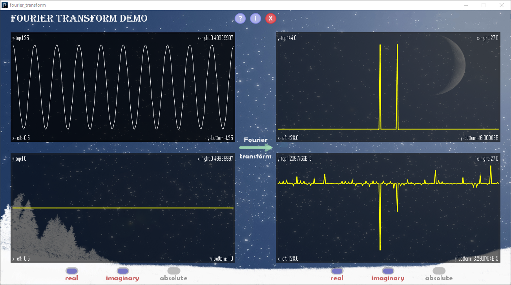
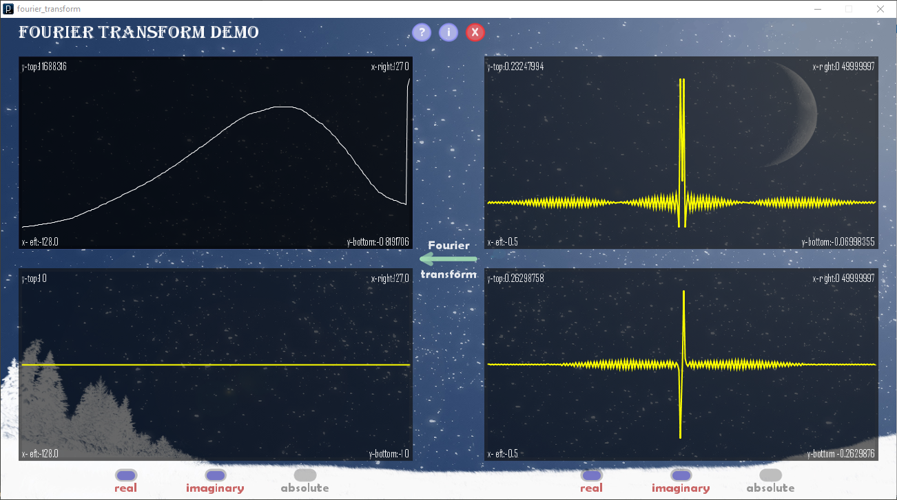

This is a real-time fourier transform demonstration program, written using
Processing 1.5.1. `src.pde` is the main program. All other sources are
support modules to the main program.

The main screen of the application contains 4 figures, 3 buttons on top,
3 buttons below each pair of figures, and a Fourier Transform arrow in
the middle. These elements of the application have been described below.

### Figures

On start, the left pair of figures indicates a time-domain sine signal
(top = real part, bottom = imaginary part), and the right pair of figures
indicates the Fourier transform of the time-domain sine signal (top =
real part, bottom = imaginary part).

### Buttons on top

From left to right, they are, Help (this), About, Close.

### Buttons below each figure pair

Allows to choose what the figures display (real, imaginary, absolute).
These buttons behave as radio buttons, and at a time, two of them are
active. The middle button is special in the way that clicking to the left
or right of it will result in a different selection.

### Fourier transform arrow

This arrow indicates the direction in which Fourier transform is taken.
Depending on whether clicked to its left or to its right, the figure pair
in the side in which is clicked is preserved and the other pair changes.

 
 
 
 

### references

- [How to embed a Processing sketch onto an HTML page](https://cs.nyu.edu/~kapp/cs101/processing_on_the_web/)
- [Tutorial 13: Working with Images](http://www.peepproject.com/tutorials/tutorial/19/view)
- [Processing.js fonts not loading](https://stackoverflow.com/q/55281154/1413259)
